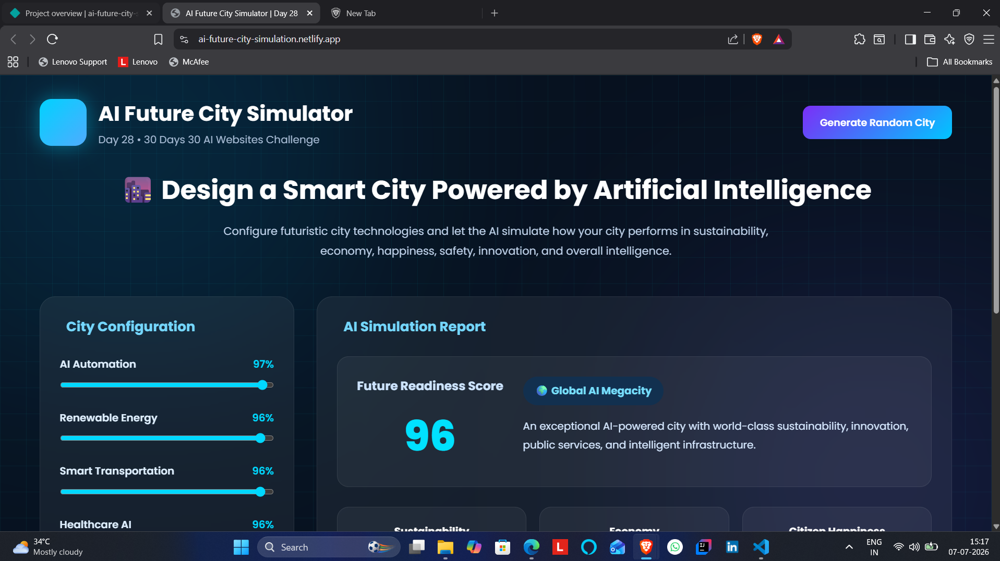
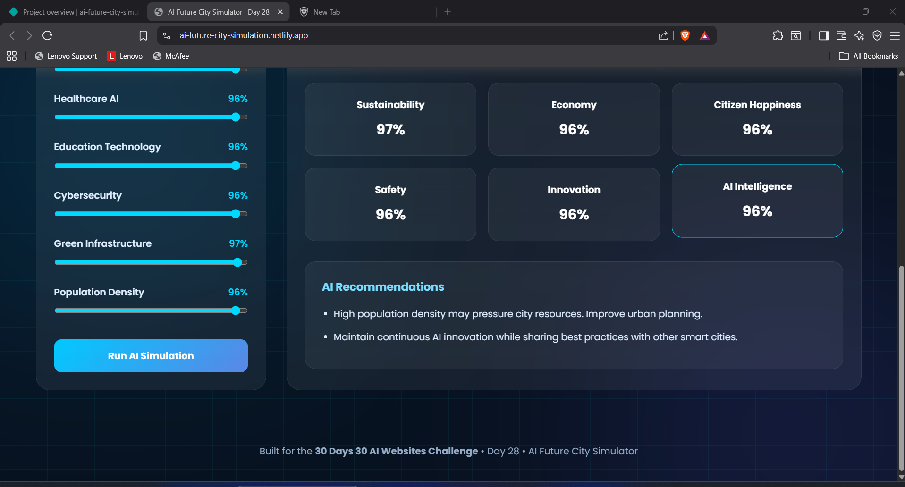

# AI Future City Simulator

## 🚀 Day 28 of my 30 Days 30 AI Websites Challenge

AI Future City Simulator is an AI-inspired web application designed to simulate how intelligent cities of the future may operate using Artificial Intelligence and smart technologies.

Instead of simply displaying futuristic concepts, the platform allows users to configure various AI-driven city systems—including AI Automation, Renewable Energy, Smart Transportation, Healthcare AI, Education Technology, Cybersecurity, Green Infrastructure, and Population Density—and instantly generate an AI simulation report.

The application evaluates the city's Future Readiness Score, Sustainability, Economy, Citizen Happiness, Safety, Innovation, and AI Intelligence while providing dynamic recommendations for building smarter, greener, and more efficient urban environments.

---

## 🌐 Live Demo

https://ai-future-city-simulation.netlify.app/

---

## 📸 Screenshots

---

## ✨ Features

- AI Future City Simulation
- Interactive Smart City Configuration
- Future Readiness Score
- Sustainability Analysis
- Economy Evaluation
- Citizen Happiness Index
- Safety Assessment
- Innovation Score
- AI Intelligence Score
- AI-Powered City Ranking
- Smart Recommendations Engine
- Random Future City Generator
- Responsive Glassmorphism UI

---

## 📋 How It Works

1. Open AI Future City Simulator.
2. Configure the smart city using interactive sliders.
3. Adjust AI Automation, Energy, Transportation, Healthcare, Education, Security, Green Infrastructure, and Population.
4. Click **Run AI Simulation**.
5. View the AI-generated city performance report.
6. Analyze the Future Readiness Score and individual metrics.
7. Read AI recommendations for improving the city's development.
8. Generate a completely new city using the Random City Generator.

---

## 🛠️ Technologies Used

- HTML
- CSS
- JavaScript
- Built with the help of AI-assisted development tools

---

## 🎯 Challenge Progress

✅ Day 28 Completed — AI Future City Simulator

Part of my **30 Days 30 AI Websites Challenge**, where I build and publish one AI-powered web project every day to improve my frontend development, product-building, UI/UX design, and problem-solving skills.

---

## 👨‍💻 Author

**Bettam Anand**

**BTech CSE(Data Science)**

JNTUH University College of Engineering Palair
